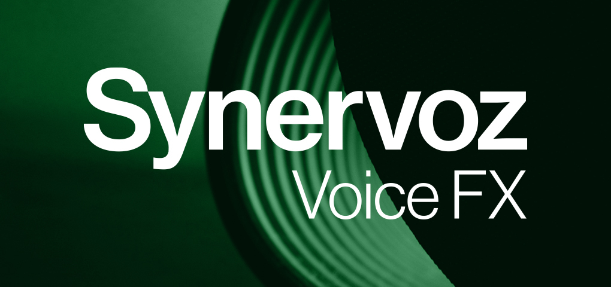

# Synervoz Voice FX

> An extension for Agora

  

  

Voice effects can be applied in real time for a variety of purposes. For example, the echo and reverb effects can be used to make it sound like a user is inside a room or hallway; the pitch shifter can be used to mask a user’s voice; and the flanger can be used to add a cool effect (i.e. a slightly delayed duplicate) while singing. Each voice effect (Echo, Reverb, Pitch Shift, Flanger) has parameters that can be modified to create the desired effect. In addition, sliders can be utilized to hear the impact of each parameter in real time. This can be used to fine tune the output for a particular use case or to teach end users about how each of the effects work. More effects and extension features are planned.

[Click here for full documentation](https://console.agora.io/marketplace/extension/introduce?serviceName=synervoz).

## Extension Features Overview

Current effects include echo, reverb, flanger, and pitch shift. Each of these has parameters that can be tweaked in real time.

## Installation

Add the URL of this repository to your Xcode 11+ Project.

Go to _File > Swift Packages > Add Package Dependency_, and paste in the link to this repository:

`https://github.com/AgoraIO-Community/Extension-Synervoz-Voice-FX-iOS.git`
